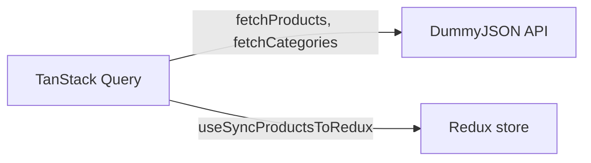
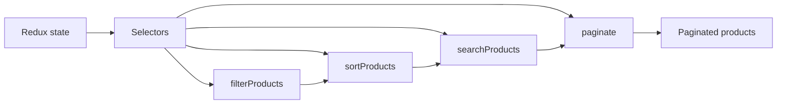
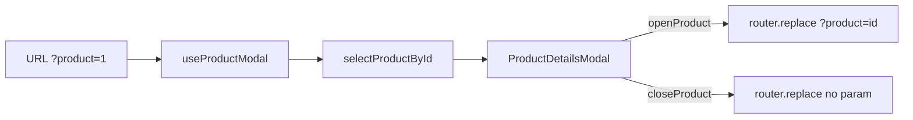
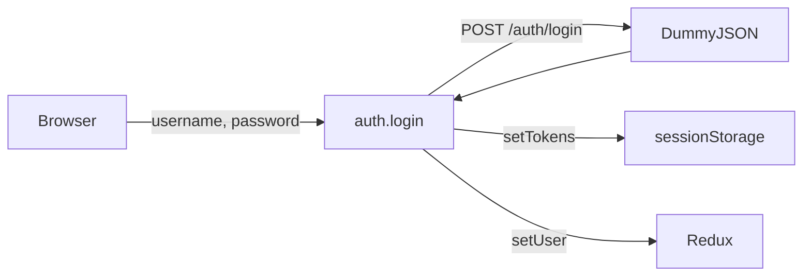
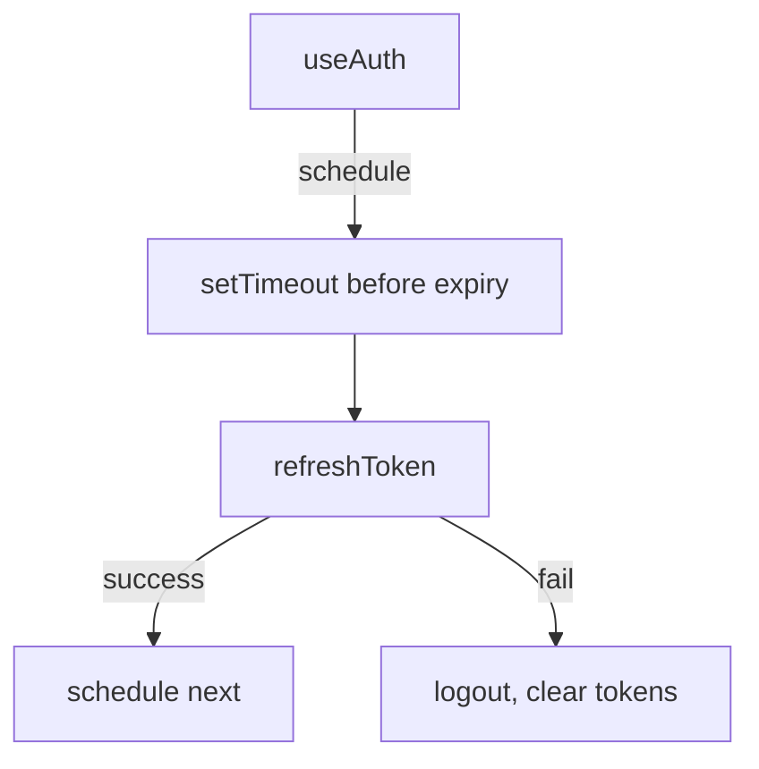
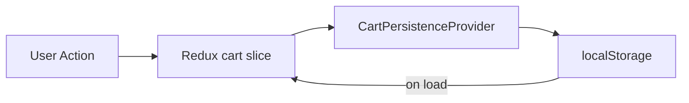

# Architecture

## Why Next.js

Next.js provides routing, SSR-capable rendering, and build tooling out of the box. We use the App Router for a modern file-based layout and routing model. The app runs primarily as a client-rendered SPA, with the home page and product modal driven by client-side state and URL params.

## Tech Stack

- **Framework:** Next.js 16 (App Router)
- **Language:** TypeScript
- **Styling:** Tailwind CSS v4
- **State:** Redux Toolkit + TanStack Query
- **Testing:** Jest + React Testing Library, Storybook with addon-a11y
- **Linting:** ESLint, Prettier
- **Pre-commit:** Husky + lint-staged
- **Deployment:** Netlify (with @netlify/plugin-nextjs)

## Project Structure

```
src/
├── app/                    # Next.js App Router
│   ├── layout.tsx         # Root layout, providers
│   ├── page.tsx           # Home page
│   ├── providers/         # Auth, Cart, Query, Redux
│   ├── services/          # API clients (products, categories, auth)
│   └── shared/            # Constants, types
├── components/            # React components (with __tests__, *.stories)
├── hooks/                 # useAuth, useProductModal, useSyncProductsToRedux, etc.
├── lib/                   # Pure utilities (filters, sort, search, pagination, auth)
└── store/                 # Redux slices and selectors
```

## Page

| Route | Purpose |
|-------|---------|
| `/` | Product listing with filters, sort, search, pagination; product detail modal via URL param |

## Data Flow

### Server state (TanStack Query)

Products and categories are fetched from DummyJSON via `fetchProducts` and `fetchCategories` in `app/services/`. `useSyncProductsToRedux` runs on the home page and syncs query results into Redux.



### Client state (Redux)

Redux holds filters, sort, search, pagination, cart, and auth. Selectors in `store/selectors.ts` compose pure functions from `lib/` to derive filtered, sorted, searched, and paginated products.



### Product modal (URL params)

The product detail modal is driven by the `product` URL search param. `useProductModal` reads the param, selects the product from Redux via `selectProductById`, and updates the URL on open/close.



## Services

API calls run in the browser and target DummyJSON directly.

| Service | Purpose |
|---------|---------|
| `products` | Fetch all products (mapped to our Product type) |
| `categories` | Fetch category list |
| `auth` | Login, getMe, refreshToken, logout (token storage in sessionStorage) |

## Authentication

Authentication uses DummyJSON's auth endpoints. Tokens are stored in **sessionStorage** because we call DummyJSON from the browser; we cannot set httpOnly cookies for our domain without a backend proxy.

### Login flow

The user submits credentials from the login form. `useAuth` calls `auth.login()`, which posts to DummyJSON, receives access and refresh tokens, stores them in sessionStorage, and dispatches the user to Redux. On success, `login()` returns `true`; on failure it returns `false` and sets the error in Redux.



### Token refresh flow

`useAuth` schedules a refresh before token expiry using JWT payload decoding. On tab visibility change, it checks if the token is near expiry and triggers a refresh if needed. If refresh fails, tokens are cleared and the user is logged out.



### Logout flow

`useAuth.logout()` clears sessionStorage, dispatches `setUser(null)` and `setAuthError(null)`, and clears the refresh timeout.

## Product Listing

The home page (`/`) shows the product listing with filtering, sorting, search, and pagination. All filtering happens client-side: products and categories are fetched once, then `filterProducts`, `sortProducts`, `searchProducts`, and `paginate` are applied via Redux selectors.

### Filtering

- **Category:** Client-side via `filterProducts` (product.category matches categorySlug)
- **Price range:** Client-side via `filterProducts` (PRICE_RANGES define min/max)
- **Search:** Client-side via `searchProducts` (name matches searchQuery, case-insensitive)

### Sorting

`sortProducts` uses `SORT_OPTIONS` from constants as a single source of truth. Each option has `sortBy` (Product field) and `order` (asc/desc). Adding a new sort = adding one object to `SORT_OPTIONS`.

### Pagination

`paginate` slices the filtered/sorted list by `currentPage` and `pageSize`. Pagination resets when filters, sort, or search change (via `resetPagination` in `ConnectedProductsGrid`).

## Product Details

Products can be viewed in a **modal**. Clicking a product card (Details button) calls `openProduct(id)`, which sets `?product=id` in the URL. `useProductModal` reads the param and selects the product from Redux. `ProductDetailsModal` renders the full product with `AddToCartControls`. The modal closes when the param is removed or when the product is no longer in the catalog.

## Cart

The cart lives in Redux and is persisted to localStorage.



- **On load:** `CartPersistenceProvider` reads from localStorage and dispatches `setCart(items)`.
- **On change:** A store subscriber in `CartPersistenceProvider` writes `state.cart.items` to localStorage whenever the cart changes.

### Cart structure

Each cart item has: `productId`, `quantity`, `name`, `price`, `image`. The cart supports add, update quantity, and remove. `selectCartTotalCount` sums quantities for the badge.

## Husky & Pre-commit

Every commit runs **lint-staged** (Husky pre-commit hook):

1. **ESLint** — Lint and auto-fix staged `.ts`, `.tsx`
2. **Prettier** — Format staged files
3. **Jest** — Run `jest --bail --findRelatedTests` for staged files

This keeps lint and test errors from reaching CI and enforces shared standards.

## Security

### Token storage

Tokens are stored in **sessionStorage** because we call DummyJSON directly from the browser. httpOnly cookies would require a backend proxy. sessionStorage clears when the tab closes, reducing exposure compared to localStorage.

For production, use a **backend proxy** and **httpOnly cookies**.

### XSS prevention

- No `dangerouslySetInnerHTML`; all content rendered through React (auto-escaped).
- Tokens never logged, never in URLs.

### Recommendations

- Backend proxy for httpOnly cookies
- CSP, X-Frame-Options, HSTS in production
- Rate limiting and CAPTCHA on login

## Code Philosophy: Readability Over Minimization

We prefer clear, maintainable code. Example: `sortProducts` uses `SORT_OPTIONS` as a single source of truth instead of a switch with duplicated IDs. Adding a new sort = one new object in `SORT_OPTIONS`; no changes to `sortProducts` or the Sort dropdown.

## Accessibility

- `aria-label` on interactive elements
- `aria-labelledby`, `aria-describedby` for dialogs and forms
- `aria-live`, `role="alert"` for errors; `role="status"` for loading
- `sr-only` labels where needed
- Storybook addon-a11y for checks during development

## Deployment

The app deploys to Netlify via `@netlify/plugin-nextjs`. Build command: `npm run build`. The plugin handles the Next.js runtime; leave Publish directory blank in Netlify UI. Node 20 is set via `netlify.toml`.
